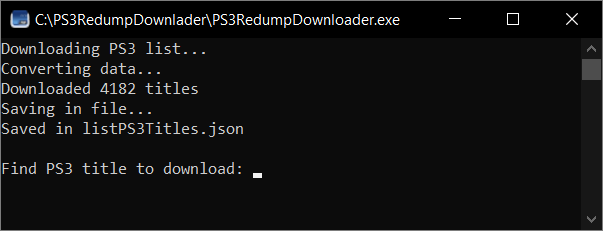
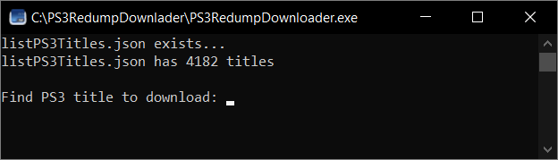
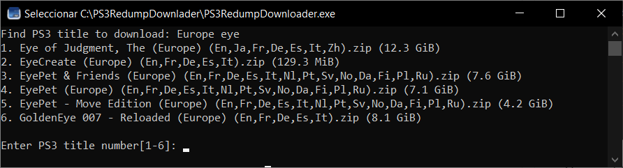
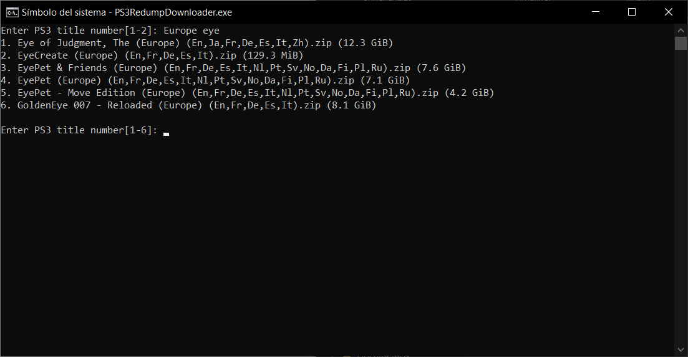
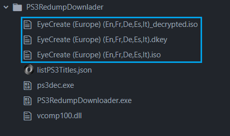

# PS3 Redump Downloader

PS3 Redump Downloader is a Python console application designed to simplify the process of downloading and decrypting [Redump PS3](https://myrient.erista.me/files/Redump/Sony%20-%20PlayStation%203/) games.

---

## Installation Guide

### Windows

#### Easy Installation

1. Download the **[latest release version](https://github.com/juanpomares/PS3-Redump-downloader/releases/download/0.1.1/PS3-Redump-downloader-0.1.1.zip)**.
2. Extract the downloaded zip file and execute **PS3RedumpDownloader.exe**.

#### Manual Download

1. Download **PS3Dec** (a utility used to decrypt PS3 ISO files). You can obtain the Windows executable from **[ConsoleMods](https://consolemods.org/wiki/File:PS3DecR5.7z)** or compile the [PS3Dec project by al3xtjames](https://github.com/al3xtjames/PS3Dec/tree/master).
2. Download the **[latest release version of PS3RedumpDownloader.exe](https://github.com/juanpomares/PS3-Redump-downloader/releases/download/0.1.1/PS3RedumpDownloader.exe)** from this project.
3. Execute **PS3RedumpDownloader.exe**.

### Other Operating Systems

1. Download and compile the [PS3Dec project by al3xtjames](https://github.com/al3xtjames/PS3Dec/tree/master).
2. Clone this repository in the same folder.
3. Install the required Python packages requests and BeautifulSoup using pip: `pip install requests beautifulsoup4`.
4. Execute `python main.py`.

---

## How to Use

Upon first opening the tool, it connects and downloads all available PS3 ISO images. This list will be saved in a file named _listPS3Titles.json_.

Subsequent openings will load this list from the file.

The app will display the message 'Find PS3 title to download'. You can input the full title or part of it to filter the list. For example, 'Europe Eye'.

Each game in the list is indexed for selection. To download a specific game, input its corresponding index. If you wish to perform a new search, simply input the desired title, and the list will be filtered accordingly.

For instance, to download '2. EyeCreate (Europe) (En,Fr,De,Es,It).zip (129.3 MiB)', type '2' and press Enter. The download process will commence, starting with the download and unzipping of the ISO, followed by the key and finishing with the decryption.

Once the process is complete, three new files will be created in the folder: Title_decrypted.iso and the original files (which can be deleted) Title.iso and Title.dkey.

---

## Contributions

Contributions are welcome. If you find any bugs or have any suggestions for improvement, feel free to open an issue or submit a pull request.

## Credits

- [al3xtjames](https://github.com/al3xtjames/) for creating [PS3Dec](https://github.com/al3xtjames/PS3Dec/tree/master)

### Author

This project was developed by **[juanpomares](https://github.com/juanpomares/)**.

### License

This project is licensed under the MIT License. You are free to use, modify, and distribute this project, provided you include attribution to the original author.
