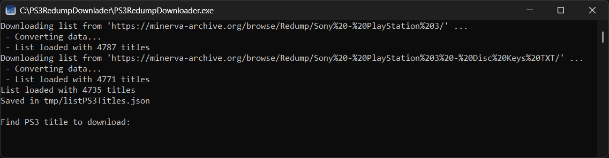
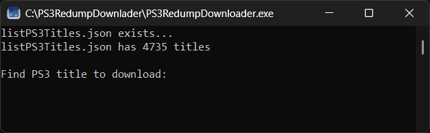
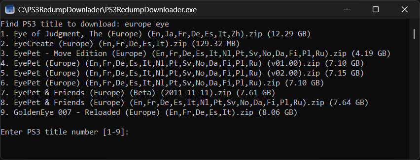
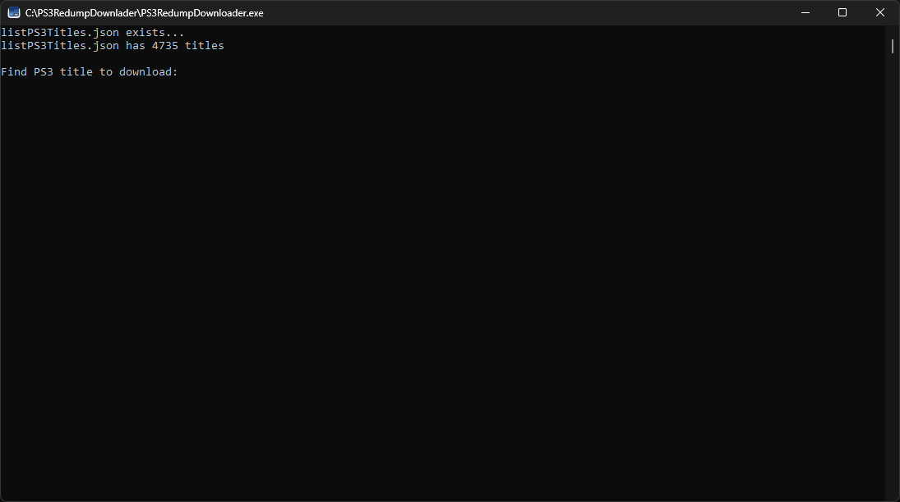
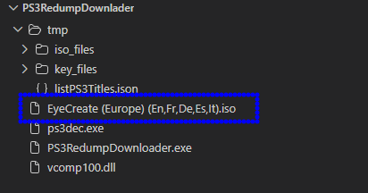

# PS3 Redump Downloader

PS3 Redump Downloader is a console application that helps download and process PS3 disc image files from [Minerva Archive](https://minerva-archive.org/) and decrypt them using **PS3Dec**.

The application automatically downloads both the game image and its corresponding disc key, extracts them, and uses PS3Dec to generate the decrypted ISO.

This project is not affiliated with Minerva Archive.

## Project status

The project currently uses **Minerva Archive** as its upstream source.

Downloads are handled through **BitTorrent `.torrent` files** retrieved directly from Minerva Archive. The application uses libtorrent to download only the required game and disc key files from their respective torrents.

## Intended use / legal

This tool is intended for **lawful personal use**, such as working with **disc dumps you made yourself** or content you otherwise have the rights to use.

You are responsible for complying with applicable laws in your jurisdiction.

---

## Installation Guide

### Windows

#### Easy Installation

1. Go to the **[Releases page](https://github.com/juanpomares/PS3-Redump-downloader/releases)** and download the latest `.zip`.
2. Extract the downloaded ZIP file.
3. Run **PS3RedumpDownloader.exe**.

No Python installation is required when using the compiled release.

#### PS3Dec

PS3Dec is required to decrypt the downloaded PS3 ISO files.

You can:

- Download a Windows build from **ConsoleMods**:
  https://consolemods.org/wiki/File:PS3DecR5.7z
- Or compile it yourself from **al3xtjames/PS3Dec**:
  https://github.com/al3xtjames/PS3Dec

Place `PS3Dec.exe` next to `PS3RedumpDownloader.exe`.

### Running from source

If you prefer to run the application directly with Python:

1. Install **PS3Dec** and make sure it is available to the application.
2. Clone this repository.
3. Install the required Python dependencies:

```bash
pip install requests beautifulsoup4 tqdm libtorrent
```

4. Run:

```bash
python main.py
```

The source version retrieves `.torrent` files from Minerva Archive and uses **libtorrent** to download only the selected files.

---

## How to Use

On first launch, the application connects to Minerva Archive and downloads the available PS3 game and disc key lists.

Only games for which both the game file and the corresponding disc key are available are included.

The resulting list is cached in:

```text
tmp/listPS3Titles.json
```



Subsequent launches will load the cached list instead of downloading it again:



The application will display:

```text
Find PS3 title to download:
```

Enter a full title or part of a title to filter the available games.



Each result is assigned a number. Enter the desired number and press **Enter**.

The application will then automatically:

1. Retrieve or reuse the corresponding `.torrent` file.
2. Download only the selected game ZIP using libtorrent.
3. Retrieve or reuse the disc key `.torrent` file and download the corresponding key ZIP.
4. Extract both files.
5. Decrypt the ISO using PS3Dec.
6. Generate the decrypted PS3 ISO.



Once completed, the decrypted ISO will be available in the application folder.



---

## Alternative torrent client

The application can also be configured to use an external torrent client instead of the built-in libtorrent downloader.

This can be configured independently for game and disc key downloads in `config.ini`:

```ini
EXTERNAL_ISO = 0
EXTERNAL_KEY = 0
```

Set either value to `1` to manually download that file using your preferred torrent client.

The application will provide the corresponding `.torrent` file and wait for the requested ZIP file to be copied into the indicated folder.

---

## Contributions

Contributions are welcome, especially bug fixes and maintenance improvements.

If you find a bug or want to suggest an improvement, please open an issue or submit a pull request.

---

## Credits

- **al3xtjames** for creating **PS3Dec**: https://github.com/al3xtjames/PS3Dec

- **Minerva Archive** for providing the upstream archive used by the application: https://minerva-archive.org/

## Author

Developed by **juanpomares**: https://github.com/juanpomares/

## License

This project is licensed under the **MIT License**.

You are free to use, modify, and distribute this project, provided you include attribution to the original author.
